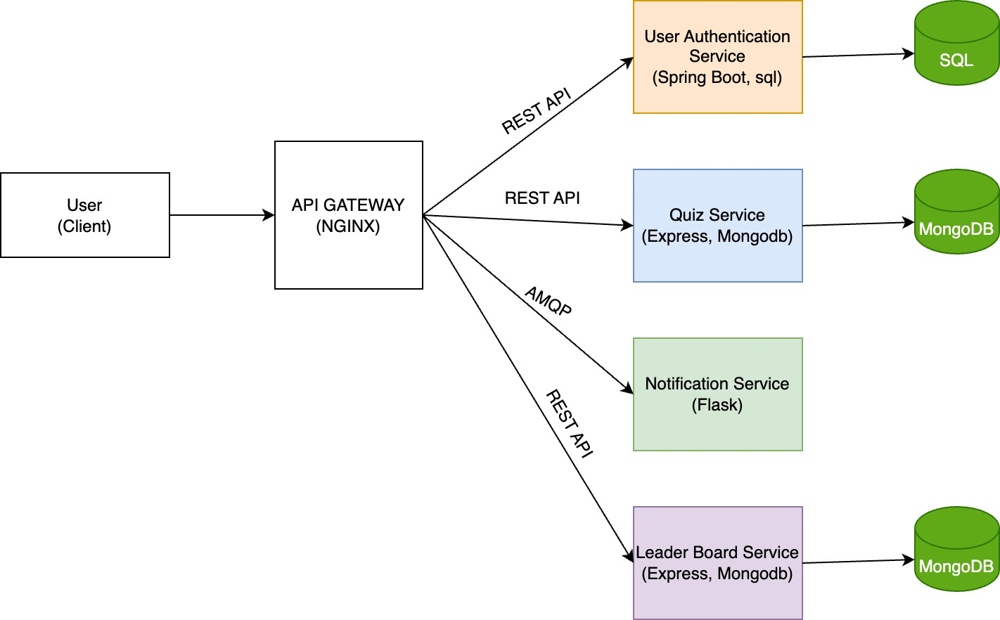
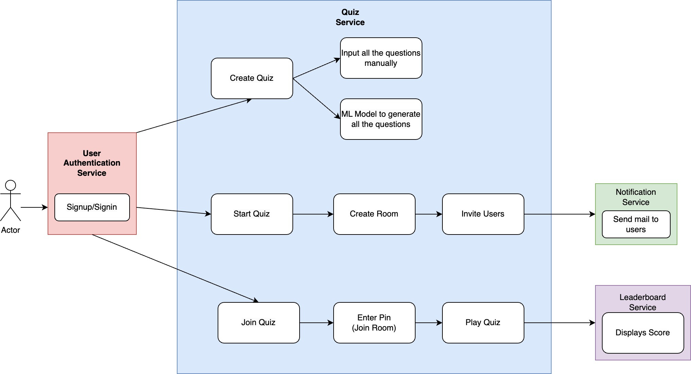

## Brainy Bee Virtual Collaboration App

Brainy Bee is a virtual collaboration app designed for organizations to facilitate interactive quizzes among participants. This README provides an overview of the project's functionalities, technology stack, future implementations, and current working items/features.

### Functional Requirements

- **Admin Dashboard**: Admin can create, update, and manage quizzes.
- **Quiz Creation**: Admin can add questions and options for the quiz.
- **Room Creation**: Admin can initiate a quiz by creating a room for participants.
- **Participant Invitation**: Admin can invite participants via email to join the quiz.
- **Score Tracking**: During the quiz, scores are updated in real-time on a leaderboard.

### Non-Functional Requirements

- **Security**: User authentication is ensured using Spring Boot and SQL.
- **Scalability**: Microservices architecture ensures scalability and modularity.
- **Real-time Updates**: Scores are updated promptly using Redis for leaderboard microservice.
- **Reliability**: Dockerization of microservices ensures easy deployment and management.

## Tech Stack Details

#### User Authentication Microservice
- **Tech Stack**: Spring Boot, SQL

#### Quiz Microservice
- **Tech Stack**: MERN (MongoDB, Express.js, React.js, Node.js)

### Notification Microservice
- **Tech Stack**: Flask, RabbitMQ

#### Leaderboard Microservice
- **Tech Stack**: MERN (MongoDB, Express.js, React.js, Node.js), Redis

#### Current Working Item/Feature

- **API Gateway Configuration**: Nginx is configured as an API gateway for all microservices.

### Future Implementations

- **Automated Question Generation**: Implement machine learning models to generate quiz questions based on given topics.
- **UI Development**: Create a user-friendly interface for seamless interaction.
- **Team Quizzes**: Allow teams to compete against each other, fostering collaboration and group problem-solving.

### Architecture 

The architecture follows a microservices-based approach where each component is deployed as an independent service. Services communicate through APIs, ensuring loose coupling and scalability.

### Flow Chart

## Getting Started

To get started with the project, follow these steps:

1. Clone the repository.
2. Navigate to the project directory.
3. Configure .env files
4. Run `docker-compose up --build` to start the servers.

Ensure Docker and Docker Compose are installed on your system for seamless deployment.

